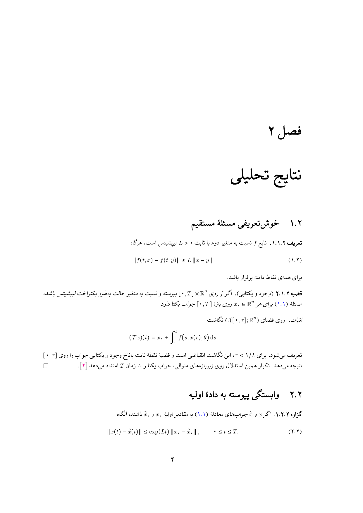
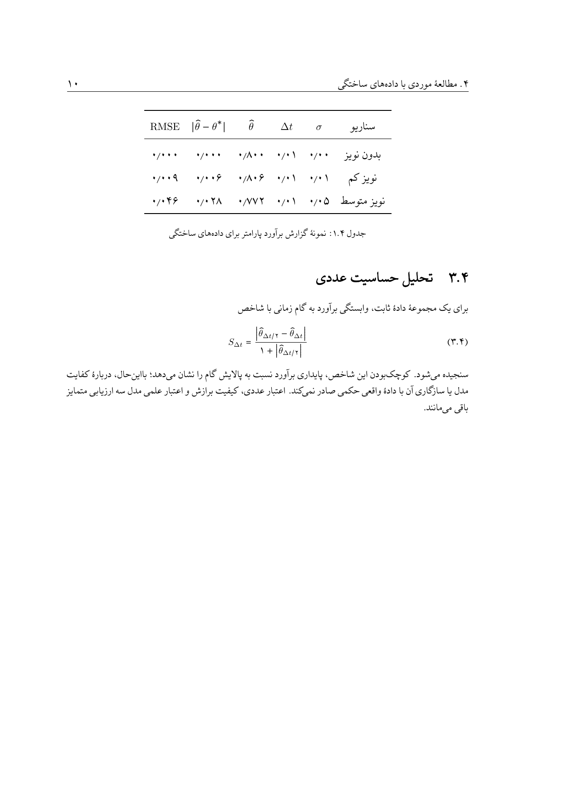

# قالب LaTeX پایان‌نامه و رساله دانشگاه تربیت مدرس

[](https://github.com/shokoofe-akbari/TMU-Thesis-Template/actions/workflows/latex.yml)
[](https://github.com/shokoofe-akbari/TMU-Thesis-Template/releases/latest)

قالب مستقل نگارش پایان‌نامه کارشناسی ارشد و رساله دکتری دانشکده علوم ریاضی دانشگاه تربیت مدرس، با پشتیبانی از فارسی، فرمول‌های ریاضی، قضیه و اثبات، جدول، شکل، واژه‌نامه، نمایه و دو شیوه مدیریت منابع.

> [!IMPORTANT]
> این مخزن یک ویرایش فنی و دانشجویی است. پیش از تحویل نهایی، انطباق نسخه مورد استفاده با مقررات جاری دانشگاه بررسی شود.

## دانلود مستقل هر مقطع

| مقطع | بسته مستقل | فایل اصلی |
|---|---|---|
| کارشناسی ارشد | [دانلود ZIP ارشد](https://github.com/shokoofe-akbari/TMU-Thesis-Template/releases/latest/download/TMU-Thesis-MSc.zip) | `Mas_Thesis_TMU.tex` |
| دکتری | [دانلود ZIP دکتری](https://github.com/shokoofe-akbari/TMU-Thesis-Template/releases/latest/download/TMU-Thesis-PhD.zip) | `PhD_Thesis_TMU.tex` |

هر بسته همه فایل‌های لازم، از جمله فونت‌های قابل‌بازتوزیع، تصاویر قالب، فایل کلاس، نمونه فصل‌ها و اسکریپت ساخت را در خود دارد. صفحه [Releases](https://github.com/shokoofe-akbari/TMU-Thesis-Template/releases) شامل نسخه‌های تاریخ‌دار و فایل کنترل صحت `SHA256SUMS.txt` است.

## امکانات

- دو قالب کاملاً مستقل برای `MSc` و `PhD`؛
- پردازش فارسی با `XeLaTeX` و فونت‌های محلی داخل هر پوشه؛
- محیط‌های استاندارد تعریف، قضیه، لم، گزاره، نتیجه، مثال و اثبات؛
- نمونه منسجم نگارش ریاضی از صورت‌بندی مدل تا تحلیل و نتایج عددی؛
- جدول‌های حرفه‌ای، شکل، پیوست، واژه‌نامه و نمایه؛
- کتاب‌نامه مبتنی بر `References.bib` و `Biber`؛
- کتاب‌نامه دستی به‌عنوان انتخاب جایگزین؛
- کنترل خودکار خطا، هشدار، ارجاع ناقص و مشکلات صفحه‌بندی؛
- ساخت و آزمون خودکار هر دو مقطع و هر دو حالت منابع در GitHub Actions؛
- Release خودکار با دو ZIP جداگانه.

## شروع سریع در ویندوز

پس از دانلود و استخراج بسته مربوط به مقطع، در همان پوشه اجرا شود:

```powershell
.\build.ps1
```

یا فایل زیر اجرا شود:

```text
build.cmd
```

خروجی در کنار فایل اصلی ساخته می‌شود. پیش‌نیاز پیشنهادی، نصب کامل `TeX Live 2024` یا جدیدتر و در دسترس‌بودن فرمان‌های `xelatex`، `latexmk`، `makeindex` و `biber` است.

## استفاده در Overleaf

1. بسته ZIP مقطع مورد نظر از بخش Releases دریافت شود.
2. در Overleaf گزینه `New Project` و سپس `Upload Project` انتخاب شود.
3. کامپایلر پروژه روی `XeLaTeX` قرار گیرد.
4. فایل اصلی مقطع به‌عنوان `Main document` انتخاب شود.

جزئیات کامل در [راهنمای شروع](docs/getting-started.md) آمده است.

## انتخاب شیوه منابع

حالت پیش‌فرض در ابتدای فایل اصلی چنین است:

```tex
\providecommand{\TMUBibliographyMode}{bib}
```

در این حالت، منابع از `Conductors/References.bib` خوانده می‌شوند. برای کتاب‌نامه دستی، مقدار `bib` به `manual` تغییر می‌کند و منابع از `Conductors/References.tex` خوانده می‌شوند. دستور ارجاع در متن در هر دو حالت یکسان است:

```tex
\cite{reference-key}
```

[راهنمای کامل منابع](docs/bibliography.md) نمونه‌های فارسی و انگلیسی هر دو روش را توضیح می‌دهد.

## ساختار مخزن

```text
TMU-Thesis-Template/
├── MSc/                  # قالب مستقل کارشناسی ارشد
├── PhD/                  # قالب مستقل دکتری
├── docs/                 # راهنماها و پیش‌نمایش‌ها
├── licenses/             # مجوز فونت‌های همراه قالب
├── scripts/              # ساخت بسته‌های Release
├── .github/              # CI، Release و فرم‌های Issue
├── CHANGELOG.md
├── CONTRIBUTING.md
├── LICENSE
└── THIRD_PARTY_NOTICES.md
```

شرح هر پوشه در [ساختار مخزن](docs/repository-structure.md) ثبت شده است.

## پیش‌نمایش






## اعتبار و نگه‌داری

ویرایش و به‌روزرسانی فنی این نسخه توسط **شکوفه اکبری**، دانشجوی دکتری ریاضی و دبیر انجمن علمی دانشجویی ریاضی کاربردی 1404-1405 دانشگاه تربیت مدرس، انجام شده است.

نام و اعتبار تهیه‌کنندگان اولیه قالب در فایل‌های منبع حفظ شده و جزئیات در [اعلان اشخاص ثالث](THIRD_PARTY_NOTICES.md) آمده است.

## مشارکت و گزارش اشکال

- برای خطای قابل‌بازتولید از فرم `Bug report` در بخش Issues استفاده شود.
- تغییر در فرم‌ها، نشان‌ها یا بخش‌های اداری دانشگاه باید در یک Pull Request مستقل و همراه با مستند رسمی ارائه شود.
- قبل از ارسال تغییر، هر دو حالت منابع با `build.ps1` یا CI آزمون شوند.

جزئیات در [CONTRIBUTING.md](CONTRIBUTING.md) و [راهنمای رفع اشکال](docs/troubleshooting.md) موجود است.

## مجوز و دارایی‌های جانبی

این مخزن ترکیبی از کد و مستندات جدید، قالب اولیه، فونت‌های دارای مجوز مستقل و دارایی‌های دانشگاهی است. فایل [LICENSE](LICENSE) دامنه مجوز هر بخش و [THIRD_PARTY_NOTICES.md](THIRD_PARTY_NOTICES.md) منشأ و مجوز فونت‌ها و اجزای جانبی را مشخص می‌کند.
